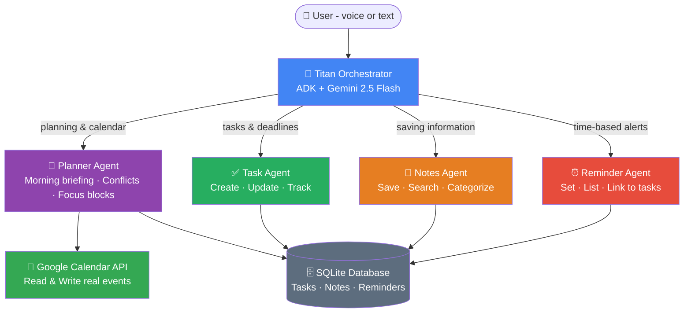

<div align="center">

# ⚡ Titan Productivity
### Your Personal AI Chief of Staff

[](https://google.github.io/adk-docs/)
[](https://deepmind.google/technologies/gemini/)
[](https://cloud.google.com/run)
[](https://python.org)

**One message. Five agents. Real results.**

[🚀 Live Demo](https://titan-productivity-976692824420.us-central1.run.app) • [📖 How it works](#how-it-works) • [🏗️ Architecture](#architecture)

</div>

---

## 🎯 What is Titan?

Titan is a **multi-agent AI productivity system** that acts as your personal chief of staff. It combines Google Calendar, task management, notes, and reminders into one intelligent conversational interface — powered by Google ADK and Gemini 2.5 Flash.

> **Try it:** Say *"Good morning Titan"* and watch five agents coordinate in real time to deliver your daily intelligence briefing.

---

## ✨ Key Features

| Feature | Description |
|---|---|
| 🌅 **Morning Briefing** | Focus score + calendar + tasks + reminders in one shot |
| 📅 **Real Calendar Integration** | Reads AND writes your actual Google Calendar |
| ⚠️ **Conflict Detection** | Proactively warns when tasks clash with meetings |
| 🎯 **Focus Block Scheduling** | Creates focus time directly in Google Calendar |
| 🔗 **Task-Calendar Linking** | Links calendar events to tasks automatically |
| 🧠 **Smart Intent Routing** | Gemini decides which agent to use — no commands needed |
| 🎤 **Voice Input** | Built-in microphone in the ADK UI |
| 📝 **Semantic Notes** | Save and search notes by meaning, not just keywords |

---

## 🏗️ Architecture


---

## 🎬 Demo Flow

**Step 1 — Morning Briefing**
You:   "Good morning Titan"
Titan: "Good morning! Focus Score: 8/10 🟢
    📅 Today's Calendar:
    → 10:00 AM — Team standup (30 mins)
    → 3:00 PM — [FOCUS] Hackathon submission

    ✅ Tasks Due Today:
    → Finish hackathon submission (HIGH PRIORITY) ⚠️

    ⏰ Reminders:
    → Review the deck at 5:00 PM

    ⚠️ Conflict detected: Task due at 6PM but
       meetings run 4-6PM. Suggest moving focus
       block to 9-11AM. Want me to do that?"

**Step 2 — Smart Scheduling**
You:   "Yes, move the focus block to 9am"
Titan: "Done! Updated '[FOCUS] Hackathon Submission'
to 9:00 AM - 11:00 AM in your Google Calendar ✅"

**Step 3 — Task Linking**
You:   "Add task: prepare demo video, due today 4pm"
Titan: "Task created (ID: a3f2bc1e) ✅
I see a focus block on your calendar this morning.
Should I link this task to it for tracking?"

---

## 🤖 Agent Breakdown

### 🧠 Titan Orchestrator (Primary)
The entry point. Reads user intent using Gemini and routes to the correct sub-agent. Never does the actual work — just coordinates.

### 📅 Planner Agent
The most powerful agent. Handles morning briefings, conflict detection, focus block creation and updating, weekly pattern analysis, and task-calendar synchronization.

### ✅ Task Agent
Full task lifecycle: create, update status, update due dates, list by priority/status.

### 📝 Notes Agent
Save meeting notes, ideas, and reference material. Semantic search finds notes by meaning.

### ⏰ Reminder Agent
Time-based reminders with optional task linking.

---

## 🛠️ Tech Stack

| Layer | Technology |
|---|---|
| Agent Framework | Google Agent Development Kit (ADK) |
| AI Model | Gemini 2.5 Flash |
| Calendar | Google Calendar API + OAuth 2.0 |
| Database | SQLite (AlloyDB-ready) |
| Deployment | Google Cloud Run |
| Language | Python 3.12 |

---

## 🚀 Getting Started
```bash
git clone https://github.com/HiteshSipani/titan-productivity.git
cd titan-productivity
python3 -m venv .venv
source .venv/bin/activate
pip install -r requirements.txt
# Add your .env file with API keys
adk web .
```

**Environment Variables**
```bash
GOOGLE_GENAI_USE_VERTEXAI=0
GOOGLE_API_KEY=your_google_ai_studio_key
MODEL=gemini-2.5-flash
```

---

## 🏆 Hackathon Submission

**Program:** Google Cloud Gen AI Academy APAC 2026 — Cohort 1
**Track:** Multi-Agent Productivity Assistant

### Requirements Checklist
- ✅ Primary agent coordinating sub-agents
- ✅ Structured data storage (SQLite)
- ✅ Multiple tool integrations (Google Calendar API)
- ✅ Multi-step workflows (morning briefing coordinates all agents)
- ✅ API-based deployment (Google Cloud Run)

---

## 🗺️ Roadmap

- [ ] AlloyDB with vector search for semantic note retrieval
- [ ] Multi-user OAuth login flow
- [ ] Push notifications for reminders
- [ ] Meeting preparation briefings 30 mins before events
- [ ] Weekly productivity pattern analysis
- [ ] Mobile app

---

<div align="center">

Built with ❤️ using Google ADK • Gemini • Cloud Run

**[🚀 Try the Live Demo](https://titan-productivity-976692824420.us-central1.run.app)**

</div>
