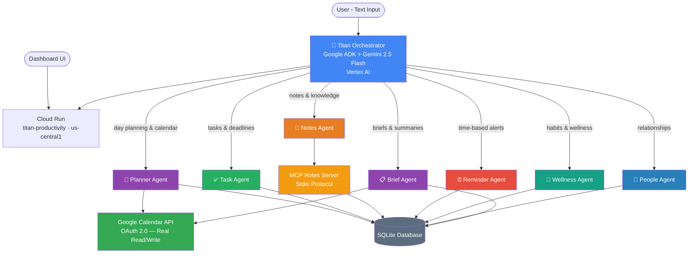

<div align="center">

# ⚡ TITAN OS
### *Your Personal AI Operating System for Life*

[](https://google.github.io/adk-docs/)
[](https://deepmind.google/technologies/gemini/)
[](https://cloud.google.com/run)
[](https://cloud.google.com/vertex-ai)
[](https://python.org)

**Not a productivity app. Not a chatbot. An operating system for your entire life.**

[🚀 Live Demo](https://titan-productivity-976692824420.us-central1.run.app) • [🏗️ Architecture](#architecture)

</div>

---

## The Vision

Titan OS is built on a simple but powerful idea: **you shouldn't have to manage your own life manually.** Your AI should know your calendar, your tasks, your relationships, your habits — and proactively surface what matters before you even ask.

Most productivity tools are reactive. You open them, you look things up, you enter data. Titan is proactive. It tells you what's overdue before your standup. It notices you haven't contacted a friend in 3 weeks. It detects that your 3pm meeting conflicts with your high-priority deadline and offers to reschedule. It nudges you to drink water at 2pm because you've been heads-down for 4 hours.

**Titan is the closest thing to having a chief of staff who never sleeps, never forgets, and always has your best interests at heart.**

---

## What Titan Does

### 🌅 Morning Intelligence Briefing
Say *"Good morning Titan"* and receive a complete daily intelligence report:

- Focus score (1–10) calculated from task load, overdue items, and relationship health
- Real Google Calendar events pulled and displayed
- Conflict detection between tasks and calendar events
- Tasks due today ranked by priority
- Overdue items flagged with urgency
- Relationship alerts — who needs your attention and for how long
- Habit streak status and wellness nudges
- Pending follow-up commitments from your people tracker

### 🤖 7 Coordinated Agents

| Agent | Responsibility |
|---|---|
| 🧠 **Orchestrator** | Intent detection and smart routing to sub-agents |
| 📅 **Planner** | Morning briefings, conflict detection, focus block scheduling |
| ✅ **Task** | Full task lifecycle — create, update, track, with duplicate detection |
| 📝 **Notes** | Save, search, and categorize notes — exposed via MCP protocol |
| ⏰ **Reminder** | Time-based reminders with habit linking |
| 🌿 **Wellness** | Habit tracking with streaks, contextual nudges, wellness score |
| 👥 **People** | Relationship tracking, interaction history, follow-up management |
| 📋 **Brief** | Meeting prep briefs, weekly summaries, manager status updates |

### 📅 Real Google Calendar Integration
Titan reads and writes your **actual** Google Calendar via OAuth 2.0. When Titan creates a focus block, it appears in your real calendar. When it detects a conflict, it is detecting a real one — not simulated data.

### 👥 Relationship Intelligence
Titan tracks people you interact with — professionally and personally:
- When you last contacted each person
- Notes from your interactions with them
- Pending follow-up commitments
- Neglected relationships flagged at 14+ days

### 🌿 Wellness Layer
- Daily and weekly habit tracking with streak counting
- Contextual nudges based on time of day — water reminders, lunch alerts, weekend family suggestions
- Wellness score calculated from habits completed vs pending

### 📋 Intelligence Briefs
Ask Titan to prepare you for a meeting and it pulls related notes, known attendees, and previous action items from your stored data. Ask for your weekly summary and it synthesizes tasks completed, habits tracked, and relationship health.

### 🎨 Titan OS Dashboard
A functional dashboard with real data views — not just a chat interface:

- **Home** — Focus score, urgent tasks, next event countdown, people needing attention, habits, active reminders
- **Tasks** — Full table with priority filters, status management, inline editing
- **Calendar** — Monthly grid with real calendar events, click any day to add an event
- **Notes** — Category-filtered grid with full add/edit/delete
- **People** — Relationship profiles with notes, follow-ups, and interaction history
- **Chat** — Resizable Titan AI sidebar always available without blocking your view
- **Light/Dark mode** — Toggle between dark and light themes, preference saved locally

---

## Architecture



---

## Demo Flow

```
1. Open Titan OS dashboard
   → Home shows focus score, 3 tasks due today, calendar event, Arjun needs attention

2. Type: "Good morning Titan"
   → Planner calls briefing data + calendar simultaneously
   → Returns: focus score, today's schedule, overdue tasks, relationship alerts, wellness nudge

3. Type: "Schedule a focus block for Q2 presentation from 2pm to 4pm"
   → Event created in real Google Calendar
   → Titan asks to link it to the matching task

4. Click Tasks tab
   → Full task table loads, edit any task inline via form popup

5. Click Calendar tab
   → Monthly grid shows real events on correct dates

6. Habit notification appears bottom-left: 💧 Drink water
   → Click Done → streak increments → sound plays

7. Type: "Prepare me for my Q2 strategy meeting"
   → Brief agent pulls related notes, known attendees, previous action items

8. Type: "Write my weekly status update"
   → Brief agent generates professional bullet-point update from completed tasks
```

---

## Tech Stack

| Layer | Technology |
|---|---|
| Agent Framework | Google ADK |
| AI Model | Gemini 2.5 Flash via Vertex AI |
| Calendar | Google Calendar API + OAuth 2.0 |
| MCP Protocol | Stdio MCP Server (Notes) |
| Database | SQLite |
| Deployment | Google Cloud Run |
| Dashboard | HTML / CSS / Vanilla JS |

---

## Roadmap

**Phase 2 — Personalization**
- User feedback loop — agents adjust behavior based on what worked and what didn't
- Productivity pattern detection — learn when a user is most effective and protect those hours
- Habit nudge timing that adapts to when the user actually completes habits

**Phase 3 — Deeper Intelligence**
- AlloyDB with vector search for semantic note and task retrieval
- Weekly pattern analysis with actionable improvement suggestions
- Career and goal trajectory tracking

**Phase 4 — Platform**
- Push notifications via mobile
- Integration with Slack, email, and GitHub
- Team and family modes
- Health data integration

---

## Getting Started

```bash
git clone https://github.com/HiteshSipani/titan-productivity.git
cd titan-productivity

python3 -m venv .venv
source .venv/bin/activate
pip install -r requirements.txt

# Create .env with your credentials
# Run locally
adk web .
```

**Environment:**
```bash
GOOGLE_GENAI_USE_VERTEXAI=1
GOOGLE_CLOUD_PROJECT=your-project-id
GOOGLE_CLOUD_LOCATION=us-central1
MODEL=gemini-2.5-flash
```

---

## Hackathon Submission

**Program:** Google Cloud Gen AI Academy APAC 2026 — Cohort 1
**Track:** Multi-Agent Productivity Assistant
**Submitted by:** Hitesh Sipani

### Requirements Checklist
- ✅ Primary agent coordinating multiple sub-agents (7 total)
- ✅ Structured data storage (SQLite — tasks, notes, reminders, people, habits, goals)
- ✅ MCP integration (Notes MCP server via Stdio protocol)
- ✅ Multiple tool integrations (Google Calendar API, SQLite, wellness tools, people tools)
- ✅ Multi-step workflows (morning briefing coordinates 7 agents with parallel tool calls)
- ✅ API-based deployment (Google Cloud Run, Vertex AI)

---

<div align="center">

**[🚀 Try the Live Demo](https://titan-productivity-976692824420.us-central1.run.app)**

Built with Google ADK · Gemini · Cloud Run · Vertex AI

</div>
